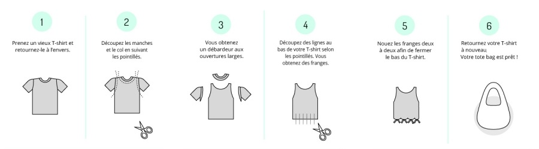

#### Objectifs : 
- Réutiliser un vieux t-shirt pour en faire un sac de courses à garder toujours à portée de main pour éviter les sacs en plastique. 

> NB : On assiste depuis quelques années à une multiplication des sacs "réutilisables" (aussi appelés totebags) sous prétexte de réduction des déchets. Il est intéressant de considérer l'impact de tous ces sacs sur l'environnement (ressources, pesticides, fabrication lointaine). Pour ces raisons, nous vous recommandons de vous interroger sur le réel besoin de fabriquer un sac si vous (ou les participants à l'atelier) en possédez déjà plusieurs. Pour en savoir plus, vous pouvez consulter [cet article de Zero Waste France ](https://www.zerowastefrance.org/noffrez-plus-de-sacs-en-coton/)

#### Matériel :
* vieux t-shirt taille adulte, si possible avec un joli motif
* Paire de ciseaux

#### Fabrication :

###### _Image et DIY issus du site idecologie.net_
1. Retourner le t-shirt à l’envers.
2. Faire des marques au niveau du col et des manches. Les découper pour former les poignées du sac. Celles-ci doivent être suffisamment larges, 5 cm minimum.
3. Faire des lignes parallèles d'environ 7 cm sur le bas du t-shirt et découper de façon à faire des franges.
4. Nouer les franges deux par deux afin de relier le bas du t-shirt. Ce sera le fond du sac.
5. Remettre le t-shirt à l’endroit. C'est terminé !

_NB : Si vous souhaitez un sac à franges, remettez votre t-shirt à l'endroit directement après l'étape 2_

