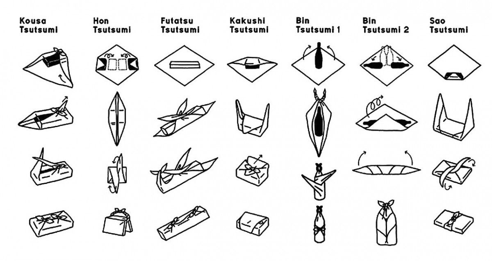

#### Objectif :
Remplacer le papier cadeaux en plastique ou en papier par une option zéro déchet et artistique

#### Matériel :

* Tissus d’occasion ou chutes de tissus
* Objets types à emballer : bouteille, boite à chaussures … (prévoir différentes formes)
* Paires de ciseaux
* Fil et aiguille

#### Fabrication :

1. Découper les tissus en carrés (65x65cm pour les grands cadeaux, à adapter selon la taille)
2. Faire l’ourlet sur les tissus (pour un meilleur rendu)
3. Emballer les cadeaux selon les méthodes qui conviennent (voir fiches ci-dessous)

#### Bao

#### Tsutsumi

Pour découvrir d'autres types de pliages, vous pouvez consulter le schéma proposé par le site .

