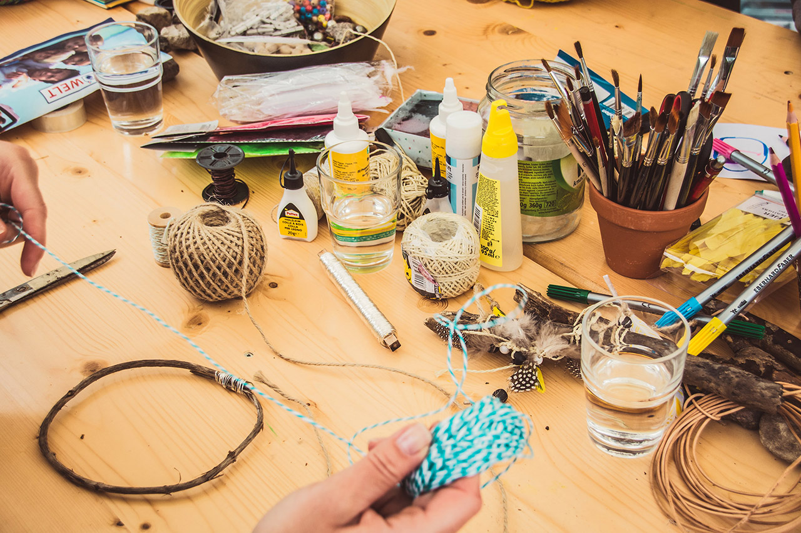

Les ateliers DIY (Do It Yourself, aussi appelés ateliers d'auto-fabrication) sont une manière ludique et pratique d'introduire des personnes au mode de vie zero waste. Il ne s'agit pas de simples "bricolages", mais de fabrication de produits qui permettent de limiter les déchets et le gaspillage, tout en éliminant certains composés jugés potentiellement nocifs par la communauté scientifique. Zero Waste Toulouse vous propose ici une série de recettes testées et approuvées par nos bénévoles. 
Si vous organisez un atelier DIY, il est très important de précéder celui-ci par quelques explications, pour que votre public comprenne bien pourquoi fabriquer des produits d'hygiène ou des produits créatifs peut être meilleur pour l'environnement. Vous pouvez pour cela expliquer le mode de vie zero waste ou encore parler du suremballage et de la pollution de l'air intérieur. N'hésitez pas non plus à évoquer les économies réalisées, surtout si vous vous adressez à un public étudiant (vous pouvez utiliser pour cela notre [Comparatif des prix spécial étudiant.es)](https://zerowastetoulouse.org/wiki/kit-pedagogique/les-outils-de-zwt/comparatif-produits-diy-vs-produits-du-commerce). Pour vous aider à expliquer tous ces enjeux aux enfants, nous vous invitons à consulter le livret ["Les héros du ZD pour sauver la planète : 6 actions"](https://www.zerowastefrance.org/wp-content/uploads/2019/01/guide-enfants-zd.pdf) publié par Zero Waste France.

## Sommaire
#### [Ateliers loisirs créatifs](https://zerowastetoulouse.org/wiki/ateliers-do-it-yourself/loisirs-creatifs)
* [Pâte à modeler](/ateliers-do-it-yourself/pate-a-modeler)
* [Peinture maison](/ateliers-do-it-yourself/peinture-maison)
* [Colle](https://zerowastetoulouse.org/wiki/ateliers-do-it-yourself/loisirs-creatifs/colle)

#### [Ateliers cosmétiques](https://zerowastetoulouse.org/wiki/ateliers-do-it-yourself/produits-cosmetiques)
* [Déodorant](/ateliers-do-it-yourself/atelier-cosmetiques-fabrication-de-deodorant-dentifrice-et-creme-hydratante)
* [Dentifrice](/ateliers-do-it-yourself/dentifrice)
* [Crème hydratante](/ateliers-do-it-yourself/creme-hydratante)

#### [Ateliers produits ménagers](https://zerowastetoulouse.org/wiki/ateliers-do-it-yourself/produits-menagers)
* [Lessive](/ateliers-do-it-yourself/lessive)
* [Spray nettoyant](/ateliers-do-it-yourself/spray-nettoyant)
* [Liquide vaisselle](/ateliers-do-it-yourself/liquide-vaisselle)
* [Débouche évier](/ateliers-do-it-yourself/debouche-evier)

#### [Ateliers créations textiles](https://zerowastetoulouse.org/wiki/ateliers-do-it-yourself/ateliers-creations-textile)
* [Tawashi (éponge lavable)](/ateliers-do-it-yourself/tawashi)
* [Totebag (sac réutilisable)](/ateliers-do-it-yourself/totebag)
* [Furoshiki (emballage cadeau réutilisable)](/ateliers-do-it-yourself/furoshiki)

!! Note : certaines recettes contiennent des huiles essentielles. Les huiles essentielles ne peuvent être utilisées pour les enfants de moins de 8 ans - sauf la lavande fine et la lavande vraie - et les femmes enceintes. Zero Waste Toulouse n'a aucune compétence médicale ou en dermo-cosmétique et écline toute responsabilité quant à l'utilisation de ces produits au quotidien.